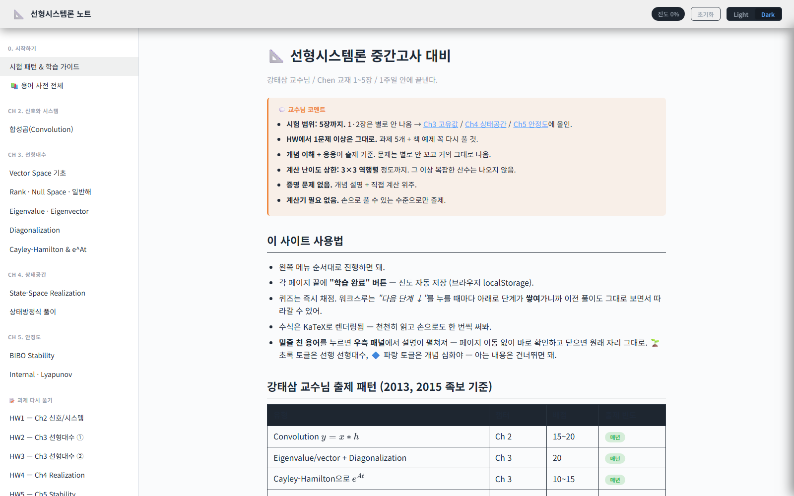
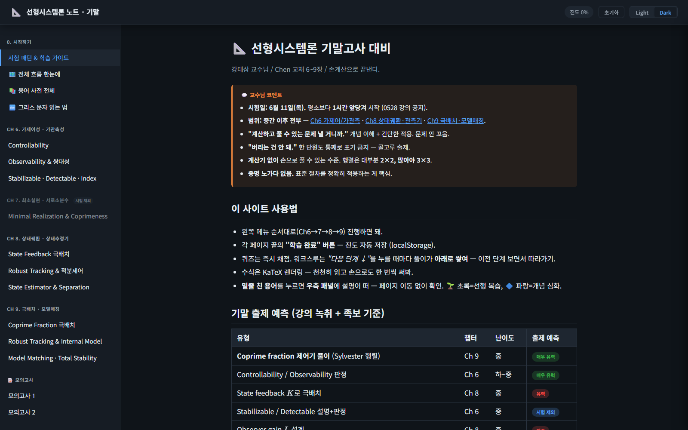
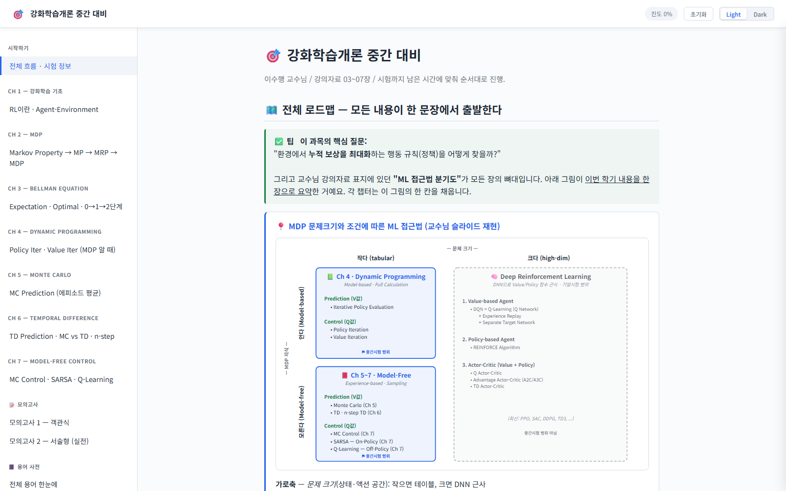

# Study Notes

대학원/학부 강의 학습 자료 모음. 각 과목은 챕터별 인터랙티브 HTML 자료(단일 페이지 앱)로 구성되어 있습니다.
사이드바 네비게이션, 진도 추적, 용어 사전 패널, KaTeX 수식 렌더링, 라이트/다크 테마, 모의고사 타이머를 지원합니다.

## 📚 과목

### [Linear Systems (선형시스템론)](./linear-systems)
- [`midterm/`](./linear-systems/midterm/index.html) — Ch2–5: convolution, eigen/rank/diagonal, realization, BIBO/internal stability + 과제(HW1–5)
- [`final/`](./linear-systems/final/index.html) — Ch6–9: controllability/observability, coprime, feedback/observer/tracking, internal model / model matching / pole placement

### [Reinforcement Learning (강화학습)](./reinforcement-learning)
- [`midterm/`](./reinforcement-learning/midterm/index.html) — RL basics, MDP, Bellman, DP, Monte Carlo, TD, control

## 사용법

각 `index.html`를 브라우저에서 열면 됩니다.
